# Project 03: aws-ebs-snapshot-disaster-recovery

## 💠Overview

* This project demonstrates a Snapshot-Based Disaster Recovery (DR) solution using Amazon EC2, Amazon EBS, EBS Snapshots, and AWS CLI.

* The solution simulates a disaster scenario where application data stored on an EBS volume is recovered by creating a new volume from an EBS snapshot and attaching it to a recovery EC2 instance.

---
## ❓Problem Statement

* Organizations store critical application data on Amazon EBS volumes attached to EC2 instances. Hardware failures, accidental deletion, or volume corruption can result in service disruption and potential data loss.

* To ensure business continuity, organizations need a reliable backup and recovery strategy that minimizes downtime and enables rapid restoration of application data.

* This project implements a Disaster Recovery solution using Amazon EBS Snapshots.

---
## ⛏️Objective

* Create a Primary EC2 Instance.
* Create and attach an EBS Volume.
* Store application data on the volume.
* Create an EBS Snapshot for backup.
* Simulate a disaster scenario.
* Restore a volume from the snapshot.
* Attach the restored volume to a Recovery EC2 Instance.
* Verify successful data recovery.

---
## 🛠️AWS Services Used
* Amazon EC2
* Amazon EBS
* Amazon EBS Snapshots
* Amazon VPC
* AWS CLI

---
## 📝Prerequisites
* AWS Account
* IAM User with EC2 and EBS permissions
* AWS CLI Configured
* EC2 Key Pair
* Security Group allowing SSH access

### ✅Operating System
* Amazon Linux 2023

### 🧷Knowledge Required
* Linux Commands
* EC2 Management
* EBS Volume Management
* AWS CLI
* Disaster Recovery Concepts

---
## ⛏️Architecture Components

| Component         | Resource Name        |
| ----------------- | -------------------- |
| Primary Instance  | EC2-EBS-Primary      |
| Primary Volume    | Primary-EBS          |
| Snapshot Backup   | Primary-EBS-Snapshot |
| Recovery Volume   | Recovery-EBS         |
| Recovery Instance | Recover-EC2-EBS      |

---
## ⚙️Solution Architecture

```text
EC2-Primary
      │
      ▼
Primary-EBS
      │
      ▼
Store Application Data
      │
      ▼
Create Snapshot
      │
      ▼
Recovery-EBS
      │
      ▼
Recover-EC2-EBS
      │
      ▼
Verify Restored Data
```
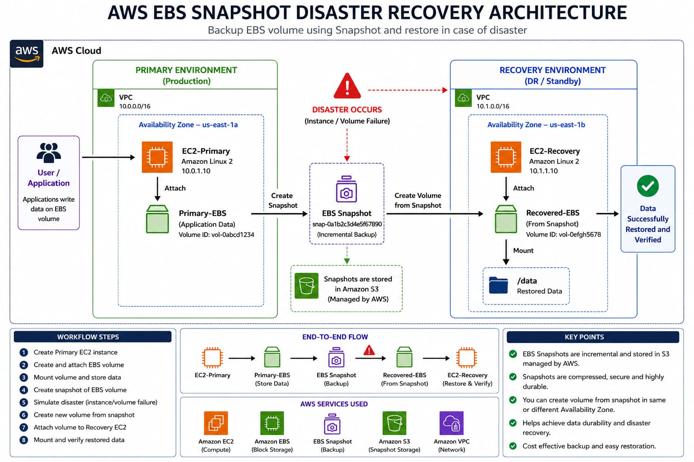

---
# 🚀Project Workflow

## Step 1: Launch Primary EC2 Instance

* Launch an EC2 instance named:

```text
EC2-EBS-Primary
```
* Connect to the instance using SSH.

Output:

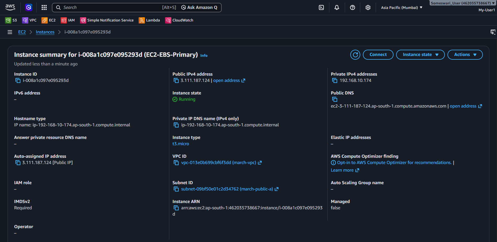

---
## Step 2: Create EBS Volume Using AWS CLI

* Create a volume 
* Check AWS CLI is installed

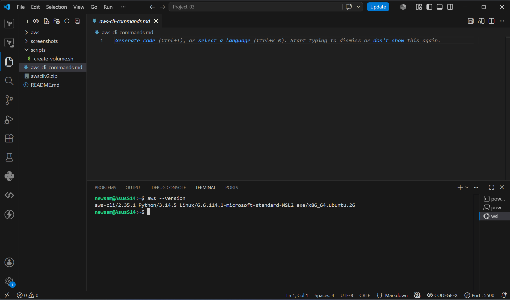

* Run:

```bash
   ./create-volume.sh # run this script
```
 Or Manually:
    
   ```bash
     aws ec2 create-volume \
     --availability-zone ap-south-1a \
     --size 5 \
     --volume-type gp2
   ```
   Output:

   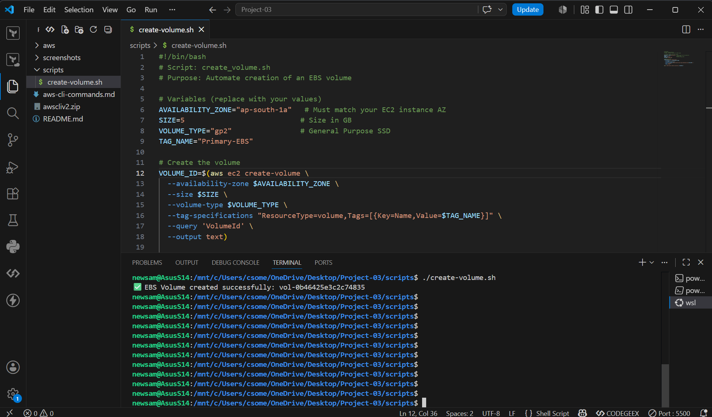


* Attach the volume to EC2-EBS-Primary.
* Check the volume is attached to the EC2 instance or not.

Output:

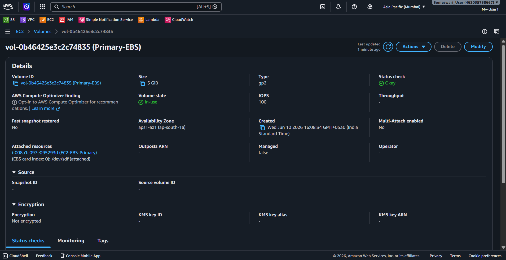

* Verify:

```bash
lsblk
```

---
## Step 3: Format and Mount Volume

* Connect to the EC2-EBS-Primary instance using SSH before performing the following steps.

* Format the volume:

```bash
sudo mkfs -t xfs /dev/nvme1n1
```

* Create mount point:

```bash
sudo mkdir /data
```

* Mount the volume:

```bash
sudo mount /dev/nvme1n1 /data
cd /data # move to the mount point.
```

* Verify:

```bash
df -h    # Check mount point and disk size we give /data.
```
Output:
Disk Formating:
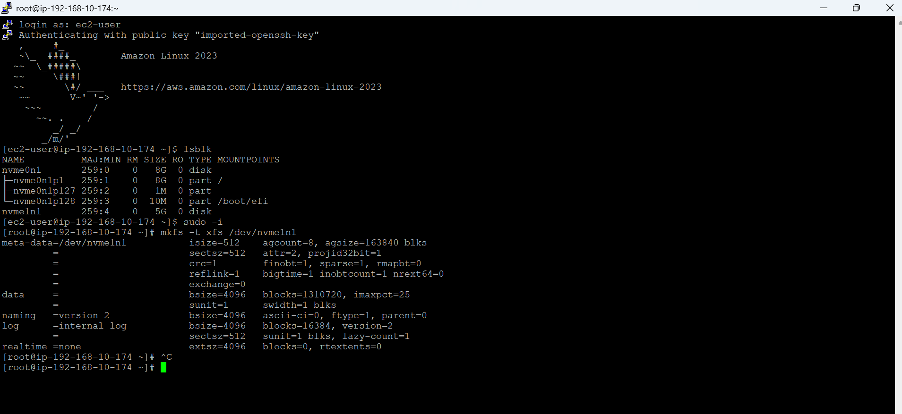

Mounting:
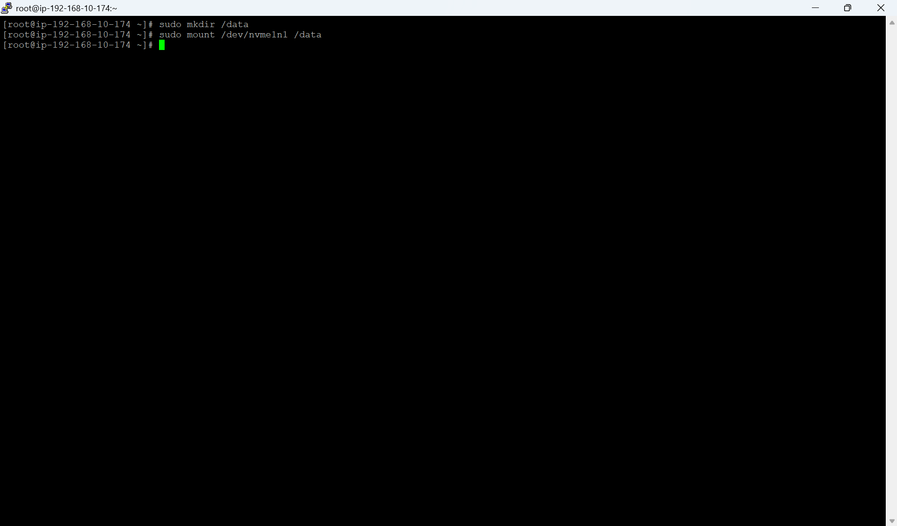


---
## Step 4: Store Application Data

* Create sample data:

```bash
echo "AWS Disaster Recovery Test" > /data/testfile.txt
```

* Verify:

```bash
cat /data/testfile.txt
```

Output:

```text
AWS Disaster Recovery Test
```
* Check the disk space after adding data.
```bash
df -h
```
Output:

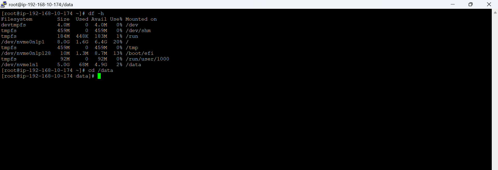

---
## Step 5: Create Snapshot Backup

* Create a snapshot of the EBS-Primary volume.

Run:

```bash
./scripts/create-snapshot.sh
```

Or manually:

```bash
aws ec2 create-snapshot \
--volume-id vol-xxxxxxxx \
--description "Primary EBS Backup" \
--region ap-south-1
```

---
## Step 6: Simulate Disaster

- Simulate one of the following:

* EC2 Instance Failure
* EBS Volume Corruption
* Accidental Data Loss
* Stopped Primary EC2
* Detached EBS Volume

- Assume the primary environment becomes unavailable.

---
* Note: 1. The volume is unmount and attach to the secondary instance is possible but volume and  instance should be in same AZ.

2.For this project i used snapshot of the volume and created a new volume from the snapshot and attached it to the secondary instance for backup.

---
## Step 7: Create Recovery Volume

* Create a new volume from the snapshot.

* Run:

```bash
./scripts/create-vol-snapshot.sh
```

Or manually:

```bash
aws ec2 create-volume \
--snapshot-id snap-xxxxxxxx \
--availability-zone ap-south-1b \
--region ap-south-1
```
Output:

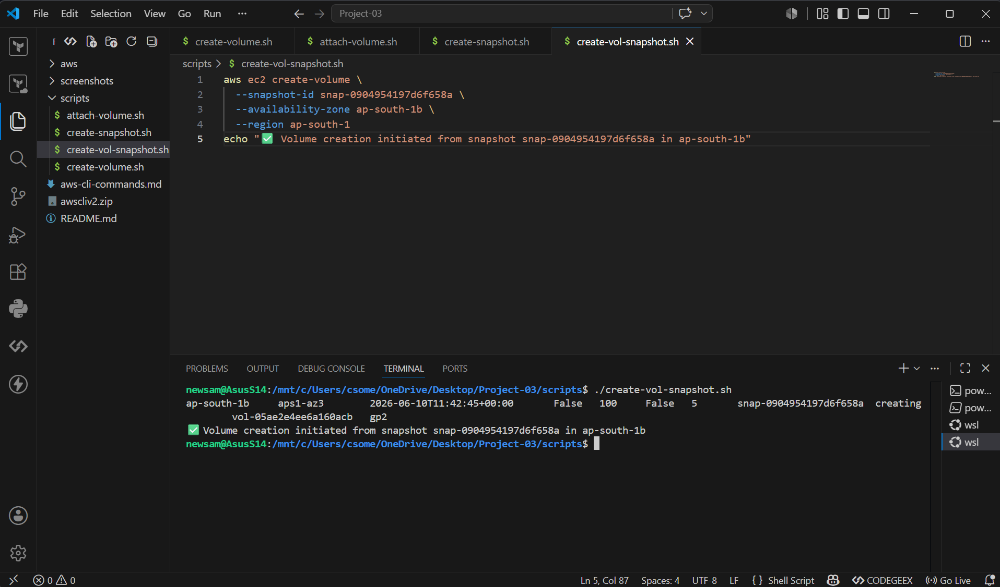

---
## Step 8: Launch Recovery EC2 Instance
* Launch the Recovery EC2 instance in the same Availability Zone as the recovered EBS volume.
* Login to the Recovery EC2 instance.
* Launch a new EC2 instance:

```text
EC2-EBS-Recover
```
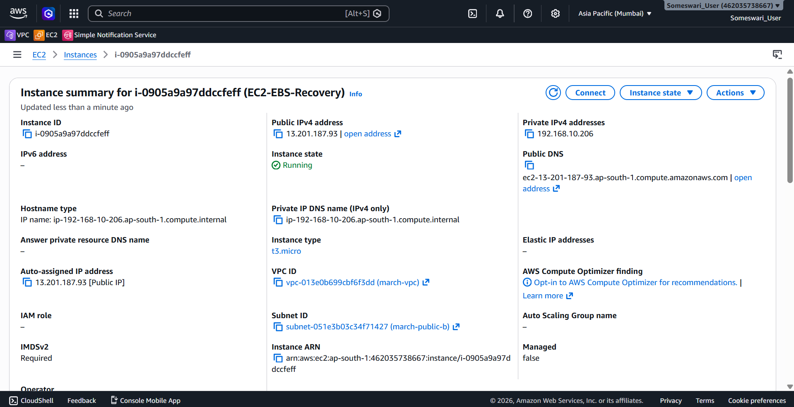

---
## Step 9: Attach Recovery Volume
* Attach the EBS volume to the Recovery EC2 instance.

Run:

```bash
./scripts/attach-vol-recovery-ec2.sh
```

Or manually:

```bash
aws ec2 attach-volume \
--volume-id vol-xxxxxxxx \
--instance-id i-xxxxxxxx \
--device /dev/sdf \
--region ap-south-1
```

Verify:

```bash
lsblk
```
Output:
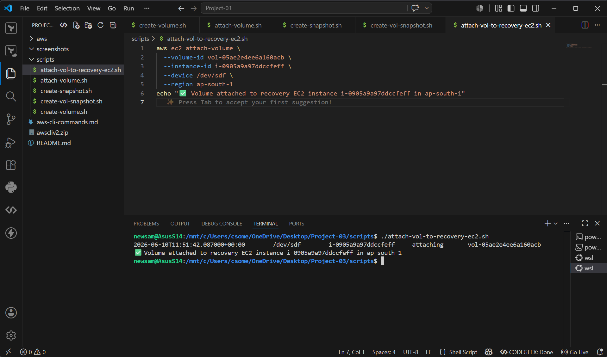

---
## Step 10: Mount Recovery Volume

* Create mount point:

```bash
sudo mkdir /data
```

* Mount volume:

```bash
sudo mount /dev/nvme1n1 /data
```

* Verify:

```bash
df -h
```
Output:
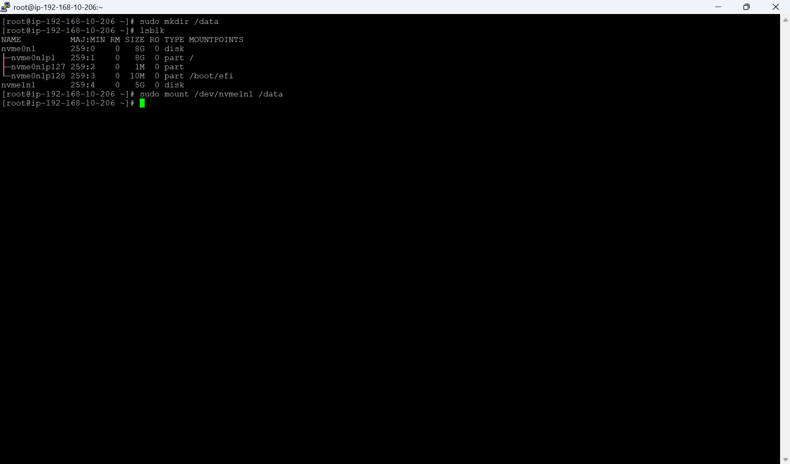

---
## Step 11: Verify Data Recovery

* Check restored files:

```bash
cd /data
ls  
```

* Verify content:

```bash
cat /data/testfile.txt
```

* Expected Output:

```text
AWS Disaster Recovery Test
```
Output:
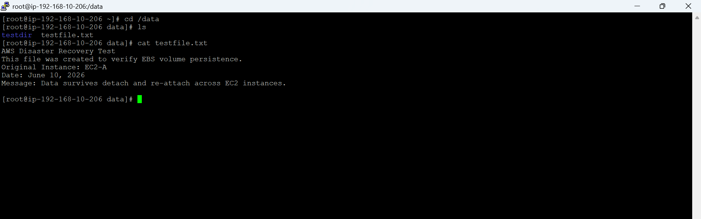

* Data recovery completed successfully.

---
## 🔗Recovery Validation

| Validation Check | Status |
|------------------|---------|
| EBS Volume Created |  ✅ |
| Application Data Stored | ✅ |
| Snapshot Backup Created | ✅ |
| Disaster Simulated | ✅ |
| Recovery Volume Created | ✅ |
| Recovery EC2 Launched | ✅ |
| Volume Mounted Successfully | ✅ |
| Data Restored Successfully | ✅ |
| Disaster Recovery Successful | ✅ |

---
## 🛡️Repository Structure

```text
AWS-EBS-Snapshot-Disaster-Recovery/
│
├── README.md
├── aws-cli-commands.md
│
├── scripts/
│   ├── create-volume.sh
│   ├── attach-volume.sh
│   ├── create-snapshot.sh
│   ├── create-vol-snapshot.sh
│   └── attach-vol-to-recovery-ec2.sh
│
|____screenshots/
│   ├── 01-create-ec2-instance.png
│   ├── 02-create-ebs-volume.png
│   ├── 03-attach-volume.png
│   ├── 04-create-snapshot.png
│   ├── 05-disaster-simulated.png
│   ├── 06-create-recovery-volume.png
│   ├── 07-launch-recovery-ec2.png
│   ├── 08-mount-volume.png
│   ├── 09-data-restored.png
│   └── 10-data-restored-to-ec2.png
│   |__ 11-disaster-recovery-successful.png
|
└── .gitignore
 ```

---
## ✅Key Learnings

* Amazon EC2 Fundamentals
* Amazon EBS Volume Management
* Snapshot-Based Backup and Recovery
* AWS CLI Automation
* Linux Storage Administration
* Disaster Recovery Architecture
* Data Durability and Persistence
* GitHub Project Documentation

---
## 🚀Outcome

* Successfully implemented a Snapshot-Based Disaster Recovery Architecture using Amazon EBS Snapshots. Application data was backed up, restored, and verified successfully on a Recovery EC2 instance after simulating a disaster scenario.

---
## 📈Future Enhancements

* Automate snapshot creation using Shell Scripts
* Implement Infrastructure as Code using Terraform
* Configure EventBridge for scheduled backups
* Cross-Region Disaster Recovery
* AMI-Based Full Instance Recovery

---
## 👧Author
Someswari.C

